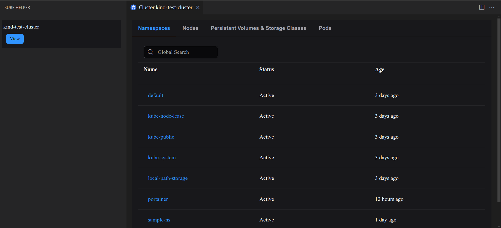
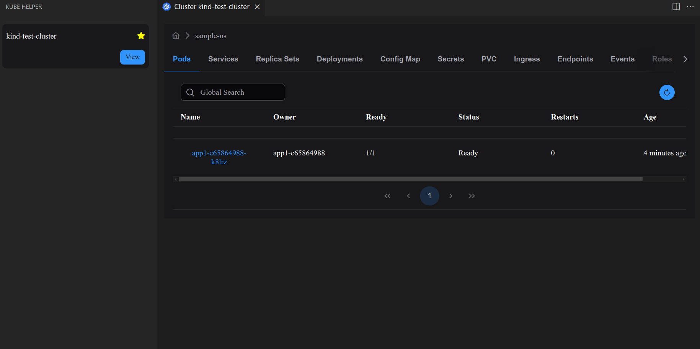
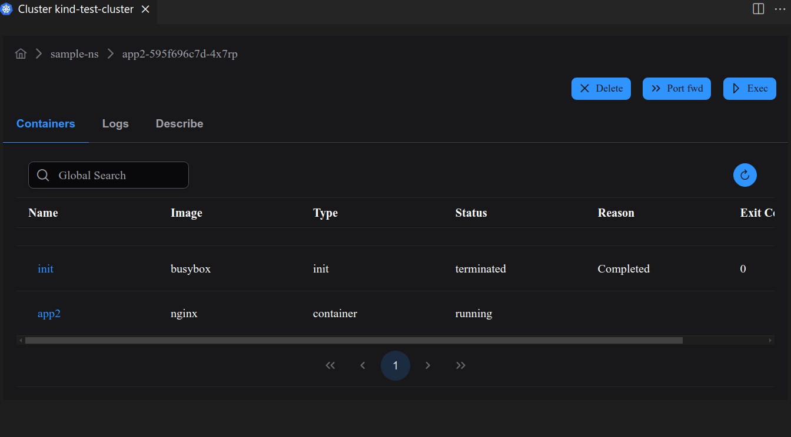

# kube-helper

Kube Helper is a wrapper for common kubectl commands that simplifies Kubernetes management by providing quick access to common kubectl commands directly within VSCode.

## 🙌 Support This Project

If you find this extension helpful (or just want to support the idea), giving the repo a ⭐ would mean a lot!

[](https://github.com/pratheeshrussell/kube-helper-vscode-ext)


## 📦 How to install
You can install the extension from the VSCode marketplace or download the vsix file from Releases and install it manually.

### From VSCode Marketplace
Search for "Kube Helper" in the VSCode marketplace and install it.

### From Releases

Download the vsix file from Releases [](https://github.com/pratheeshrussell/kube-helper-vscode-ext/releases)

Run the following command to install the downloaded vsix file
```sh
code --install-extension  kube-helper-<version>.vsix

# like
code --install-extension  kube-helper-0.0.1.vsix
```


## ✨ Features

- **Listing Resources:** Easily browse namespaces, pods, deployments, and other Kubernetes resources.
- **Editing Resources:** Modify resource configurations directly from the editor.
- **Viewing Logs:** Stream and view pod logs in real-time.
- **Executing Commands:** Run commands inside pods using `kubectl exec`.
- **Port Forwarding:** Forward ports from pods to your local machine.
- **Debug Pods:** Quickly create ephemeral debug containers.
- **Graph View:** Visualize resource relationships and dependencies.
- **Timeline & Event Tracking:** Real-time dashboard showing cluster overview and streaming Kubernetes events.
- **Kubeconfig Context Management:** View context lists in the sidebar, identify the active context with a star indicator, and easily set other contexts as the active default context.
- **ArgoCD Dashboard:** Browse ArgoCD Applications, Projects, and ApplicationSets. Check application health, sync status, initiate synchronization, refresh configurations, and inspect resources without needing the ArgoCD CLI.






## 🛠 Requirements

This extension depends on the kubectl CLI. Make sure it's installed and accessible in your system's PATH.

## ⚙️ Extension Settings

Click on the side bar icon to activate the extension.

| Setting | Default | Description |
| :--- | :--- | :--- |
| `kubeHelper.command.maxBuffer` | `50` | Max buffer size in MB for command execution (e.g., kubectl outputs). Increase this if you encounter "stdout maxBuffer exceeded" errors when fetching large resources. |
| `kubeHelper.timeline.maxEvents` | `1000` | Maximum number of timeline events to retain in memory. Older events are automatically removed when this limit is reached. |
| `kubeHelper.timeline.autoScroll` | `true` | Automatically scroll the timeline to show the latest events as they arrive. |

## 🐞 Known Issues

* Doesn't support all Kubernetes resource types yet.   
Feel free to open a [feature request](https://github.com/pratheeshrussell/kube-helper-vscode-ext/issues/new?template=2-feature-req.yml) if you'd like support for something specific


## 🙏 Credits
Icons by [icons8.com](https://icons8.com)