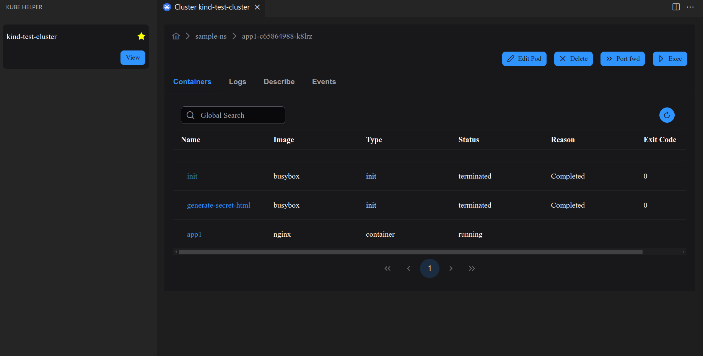

# kube-helper

This extension is a wrapper for common kubectl commands. 

## How to install
Download the vsix file from Releases and run the following command

```sh
code --install-extension  kube-helper-<version>.vsix

# like
code --install-extension  kube-helper-0.0.1.vsix
```


## Features

* List Resources like Pods, services in a cluster
* View logs
* Exec into Containers
* Port forward resources




## Requirements

This extension depends on kubectl cli. Make sure it is accessible.

## Extension Settings

Click on the side bar icon to activate the extension

## Known Issues

* Doesn't support all resources. Raise a feature request ticket if you are in need of something


## Credits
Icons by [icons8.com](https://icons8.com)