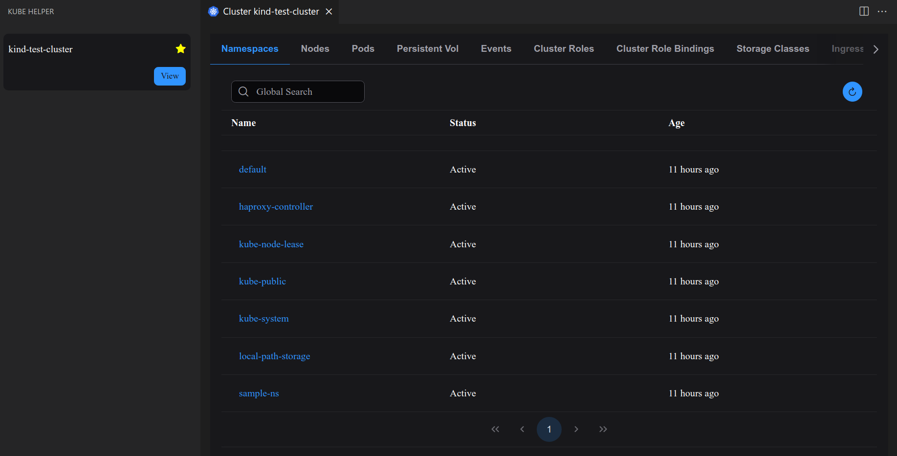

# kube-helper

Kube Helper is a wrapper for common kubectl commands that simplifies Kubernetes management by providing quick access to common kubectl commands directly within VSCode.

## 🙌 Support This Project

If you find this extension helpful (or just want to support the idea), giving the repo a ⭐ would mean a lot!

[](https://github.com/pratheeshrussell/kube-helper-vscode-ext)


## 📦 How to install
You can install the extension from the VSCode marketplace or download the vsix file from Releases and install it manually.

### From VSCode Marketplace
Search for "Kube Helper" in the VSCode marketplace and install it.

### From Releases

Download the vsix file from Releases [](https://github.com/pratheeshrussell/kube-helper-vscode-ext/releases)

Run the following command to install the downloaded vsix file
```sh
code --install-extension  kube-helper-<version>.vsix

# like
code --install-extension  kube-helper-0.0.1.vsix
```


## ✨ Features

* List Resources like Pods, services, etc., in a cluster
* Edit definition of resources like pods, deployments from VSCode
* View logs directly in VSCode
* Exec into Containers
* Port forward resources
* Create Debug Pods




## 🛠 Requirements

This extension depends on the kubectl CLI. Make sure it's installed and accessible in your system's PATH.

## ⚙️ Extension Settings

Click on the side bar icon to activate the extension

## 🐞 Known Issues

* Doesn't support all Kubernetes resource types yet.   
Feel free to open a [feature request](https://github.com/pratheeshrussell/kube-helper-vscode-ext/issues/new?template=2-feature-req.yml) if you'd like support for something specific


## 🙏 Credits
Icons by [icons8.com](https://icons8.com)